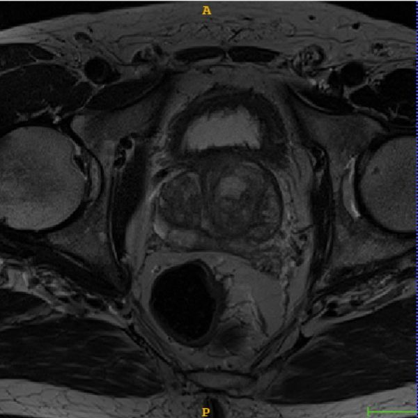
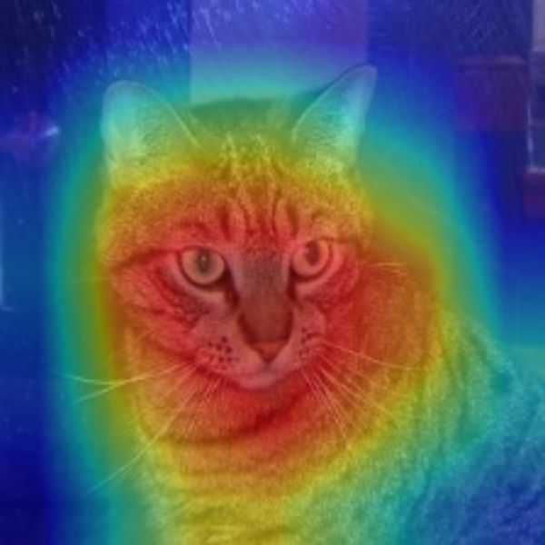
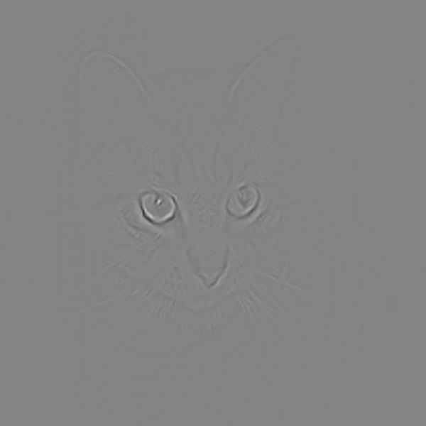
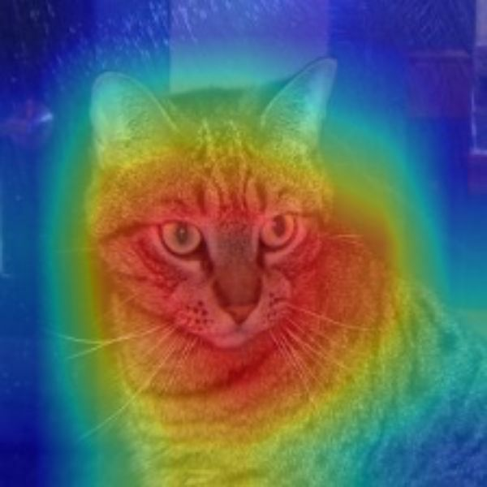

# Gcam

Gcam is an easy to use framework that makes model predictions more interpretable for humans. 
It allows the generation of attention maps with multiple methods like Guided Backpropagation, 
Grad-Cam, Guided Grad-Cam and Grad-Cam++.

## Features

* Works with classification and segmentation data / models
* Works with 2D and 3D data
* Supports Guided Backpropagation, Grad-Cam, Guided Grad-Cam and Grad-Cam++
* Attention map evaluation with given ground truth masks

## Examples

|                                            |                #1 Classification (2D)                 |                  #2 Segmentation (2D)                 |                       #3 Segmentation (3D)            |
| :----------------------------------------: | :---------------------------------------------------: | :---------------------------------------------------: | :---------------------------------------------------: |
|                  Image                     |                |                  |                  |
|          Guided backpropagation            |                  |                    |                    |
|                 Grad-Cam                   |                 |                   |                   |
|              Guided Grad-Cam               |                |                  |                  |
|               Grad-Cam++                   |               |                 |                 |


## Install gcam from source

* Install Pytorch from https://pytorch.org/get-started/locally/
* Run `python setup.py sdist bdist_wheel` to create the gcam package in the `dist` directory
* Navigate to `dist` with `cd dist`
* Install gcam with `pip install gcam-0.0.1-py3-none-any.whl`

## Install gcam requirements

* Install Pytorch from https://pytorch.org/get-started/locally/
* Run `pip install -r requirements.txt`

## Usage

```
# Import gcam
from gcam import gcam

# Init your model and dataloader
model = MyCNN()
data_loader = DataLoader(dataset, batch_size=1, shuffle=False)

# Inject model with gcam (parameters depend on your model, read the gcam.inject documentation)
model = gcam.inject(model, output_dir="results", channels=1, postprocessor="sigmoid",
                    label=lambda x: 0.5 < x, save_maps=True, evaluate=True)

# Continue to do what you're doing...
# In this case inference on some new data
model.eval()
for i, (batch, gt_mask) in enumerate(data_loader):
    # Every time forward is called, attention maps will be generated
    output = model(batch, mask=gt_mask)
    # more of your code...
```